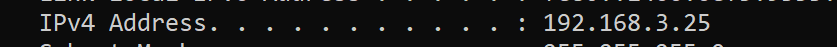
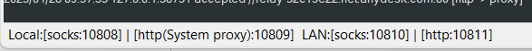
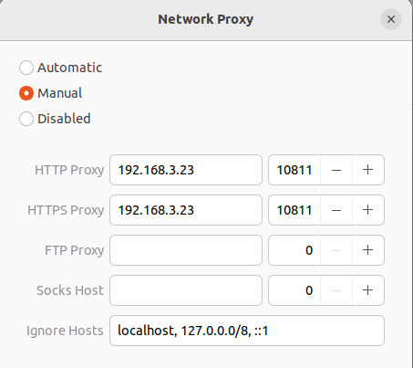

## Before Containers

***Baremetal:*** *In computer networking, a bare-metal server or physical server is computer server that is not a virtual machine, typically used by one consumer, or tenant, only. Each server offered for rental is a distinct physical piece of hardware that is a functional server on its own. They are not virtual servers running in multiple pieces of shared hardware.*

***Virtualization:*** *Virtualization is a technology that allows you to create virtual, simulated environments from a single, physical machine. Through this process, IT professionals can make use out of their previous investments and optimize a physical machine’s full capacity by distributing resources that are traditionally bound to hardware across many different environments.*\
https://www.redhat.com/en/topics/virtualization/what-is-virtualization

## Containerization
*Containerization is the packaging together of software code with all it’s necessary components like libraries, frameworks, and other dependencies so that they are isolated in their own* "***container*** ."\
https://www.redhat.com/en/topics/cloud-native-apps/what-is-containerization

______________________

### Container image
### Container
### Container runtime
### Container engine

_____________________

### OCI
### CRI

## Docker architecture


_____________________

### Set Proxy in Ubuntu VM to use host ( mine is windows ) v2ray VPN :

1. first we should see what is our host ipv4 and what is port of http of LAN in v2ray ( in host )



2. in **Wired Setting** > **VPN** > **Network Proxy** set to manual and add ip and port like below :\

### TIP : if you used v2ray on your vm ( not on your host ) use localhost instead of the ipaddress

3. use command `export http_proxy=http://192.168.3.23:10811` in terminal then use command `echo $http_proxy` to see the result
4. add line `http_proxy=http://192.168.3.23:10811` to file `/etc/environment`
5. create a fine named `http_proxy.sh` in path `/etc/profile.d` and add line `http_proxy=http://192.168.3.23:10811` in it
6. to let apt use the proxy too create a file in path `/etc/apt/apt.conf.d` named `95proxies` and fill it with :
```
Acquire::http::Proxy "http://192.168.3.23:10811/";
Acquire::https::Proxy "http://192.168.3.23:10811/";
```
7. to let wget use the proxy too add 
```
http_proxy = http://192.168.3.23:10811
https_proxy = http://192.168.3.23:10811
ftp_proxy = http://192.168.3.23:10811
```
to `/etc/wgetrc`\
8. and at the end add 
```
export http_proxy=http://192.168.3.23:10811
export https_proxy=http://192.168.3.23:10811
export ftp_proxy=http://192.168.3.23:10811
```
to `/etc/profile`

# Install Docker on Ubuntu

*Before you install Docker Engine for the first time on a new host machine, you need to set up the Docker `apt` repository. Afterward, you can install and update Docker from the repository.*
1. Set up Docker's `apt` repository.
```
# Add Docker's official GPG key:

sudo apt-get update

sudo apt-get install ca-certificates curl

sudo install -m 0755 -d /etc/apt/keyrings

sudo curl -fsSL https://download.docker.com/linux/debian/gpg -o /etc/apt/keyrings/docker.asc

sudo chmod a+r /etc/apt/keyrings/docker.asc


# Add the repository to Apt sources:

echo \

  "deb [arch=$(dpkg --print-architecture) signed-by=/etc/apt/keyrings/docker.asc] https://download.docker.com/linux/debian \

  $(. /etc/os-release && echo "$VERSION_CODENAME") stable" | \

  sudo tee /etc/apt/sources.list.d/docker.list > /dev/null

sudo apt-get update
```

2. Install the Docker packages.
```
sudo apt-get install docker-ce docker-ce-cli containerd.io docker-buildx-plugin docker-compose-plugin
```

3. Verify that the installation is successful by running the hello-world image:
```
sudo docker run hello-world
```
*This command downloads a test image and runs it in a container. When the container runs, it prints a confirmation message and exits.*

You have now successfully installed and started Docker Engine.

### Install Docker Desktop

1. Download the latest DEB package
2. Install the package using `apt`:
```
sudo apt-get update
sudo apt-get install ./docker-desktop-amd64.deb
```
## Docker use proxy to go through v2ray vpn on host
1. create a directory `/etc/systemd/system/docker.service.d` then create a file in it named `http-proxy.conf` 
2. add below in this file :
```
[Service]
Environment="HTTPS_PROXY=192.168.3.23:10811"
```
*which 192.168.3.23 is ip address of host (if you have v2ray on the linux vm you can use localhost instead of ip address) and 10811 is http port of v2ray LAN*
3. then reload the system daemon using : `systemctl daemon-reload`
4. restart the docker service using : `systemctl restart docker`
5. to see if the proxy is added to docker environment use : `systemctl show docker --property Environment`


## docker hub : 

* to just get an image :
  ```
  docker pull <imagename:tag>
  ```
  *if you don't give the tag it will pull the <imagename:latest>*

* to get and run an image (or just run an image you got before):
  ```
  docker run <imagename:tag>
  ```

* to see list of images you have now :
  ```
  docker images
  or
  docker image ls
  ```

## create image using Dockerfile

sample Docker file :
```
FROM ubuntu:latest
MAINTAINER amir.mdtf
RUN apt-get update && apt-get install -y apache2 && apt-get clean
RUN echo "Hello, World!" > /var/www/index.html
EXPOSE 80
CMD ["/usr/sbin/apache2ctl","-D","FOREGROUND"]
```

we write some commands line by line in this file. and these commands will be executed to create an image.\
the uppercase words are the words belongs to docker and let you do something.

***The Dockerfile supports the following instructions:***\
| Instruction | Description |
| ---- | ---- |
| `ADD` | *Add local or remote files and directories.* |
|`ARG` | *Use build-time variables.* |
| `CMD` | *Specify default commands.* |
| `COPY` | *Copy files and directories.* |
| `ENTRYPOINT` | *Specify default executable.* |
| `ENV` | *Set environment variables.* |
| `EXPOSE` | *Describe which ports your application is listening on.* |
| `FROM` | *Create a new build stage from a base image.* |
| `HEALTHCHECK` | *Check a container's health on startup.* |
| `LABEL` | *Add metadata to an image.* |
| `MAINTAINER` | *Specify the author of an image.* |
| `ONBUILD` | *Specify instructions for when the image is used in a build.* |
| `RUN` | *Execute build commands.* |
| `SHELL` | *Set the default shell of an image.* |
| `STOPSIGNAL` | *Specify the system call signal for exiting a container.* |
| `USER` | *Set user and group ID.* |
| `VOLUME` | *Create volume mounts.* |
| `WORKDIR` | *Change working directory.* |
https://docs.docker.com/reference/dockerfile/#arg

use command below to build an image using the Dockerfile :
```
docker build . -f filename
```
if you do not use the `-f filename` it will search for a file named "Dockerfile" in your pwd when run the command and use that file. but if you want to use another file you should use `-f filename`

________________________

* to remove an image :
  ```
  docker image ls # to copy the Image ID of image you want to remove
  docker image rm <Image ID>
  ```
  if you run a container using an image, before removing the image, you should remove the container.    

## give name to image :

when building image using Dockerfile use use `-t name:tag` to give it name and tag, if you don't give name and tag, the name and tag well be <none>
```
# example
docker build -t apache:1.0.3 . -f Dockerfile
```

* to run a container using an image :
  ```
  docker run <imageID> or <imageName:tag> -d
  ```
  if you want to run the container in `detached` mode, to not see the logs, use `-d`

* to see containers list :
  ```
  docker ps #Up containers list
  docker ps -a #all containers even those are not Up
  ```

* to start a down container and stop an up container :
  ```
  docker start <CONTAINER ID>
  docker stop <CONTAINER ID>
  ```
  *if you want to remove a container you should first stop it.*

* to remove a container :
  ```
  docker rm <CONTAINER ID>
  ```

## Publishing ports
*Publishing a port provides the ability to   break through a little bit of networking isolation by setting up a forwarding rule. As an example, you can indicate that requests on your host’s port `8080` should be forwarded to the container’s port `80`. Publishing ports happens during container creation using the `-p` (or `--publish`) flag with `docker run`. The syntax is:*
```
docker run -d -p HOST_PORT:CONTAINER_PORT nginx
```
* *`HOST_PORT` : The port number on your host machine where you want to receive traffic*
* *`CONTAINER_PORT` : The port number within the container that's listening for connections*

*For example, to publish the container's port `80` to host port `8080`:*
```
docker run -d -p 8080:80 nginx
```
*Now, any traffic sent to port `8080` on your host machine will be forwarded to port `80` within the container.*

in image we built using Dockerfile  we can run a container using :
```
docker run -d -p 8000:80 apache:1.0.3
```
then in a browser in localhost go to `localhost:8000` and we should see the apache main page.

____________________

* to see logs of a container :
  ```
  docker logs <CONTAINER ID>
  ```
  *we can use `-f` to see container logs lively*

* to enter a running container :\
  ```
  docker exec -it <CONTAINER ID> sh (bash , ...)
  ```

## another example of docker file
```
FROM openjdk:17-jdk
MAINTAINER amir.mdtf
LABEL env=production
USER amirmohamad
ENV APPAREA /data/app
RUN mkdir -p $APPAREA
ADD jenkins.war $APPAREA
WORKDIR $APPAREA
EXPOSE 8080
CMD ["java","-jar","jenkins.war"]
```
i downloaded tht `jenkins.war` file before and it is in same pwd as Dockerfile.
when we build the image and create a container using that image and use `exec` command to go into the container, first if we use `pwd` command we are in `/data/app/` pwd which specified as `WORKDIR` in Dockerfile. then if we use `ls` in that directory we see the `jenkins.war` file there which we added by `ADD`. and if we use `docker ps` command column we see the CMD command there.

we could use `ARG` in it to difine a variable to use it in the Dockerfile. like `ARG time=3s`.

***CMD or ENTRYPOINT*** : *in any dockerfile we should have CMD or ENTRYPOINT or both*\
ENTRYPOINT is the command which should be executed (if you dont use the default ENTRYPOINT which is /bin/sh -c will be used) but CMD is the arguments given to ENTRYPOINT. you can use all in ENTRYPOINT.

```
CMD ["java","-jar","jenkins.war"]
```
equals
```
ENTRYPOINT ["java"]
CMD ["-jar","jenkins.war"]
```

by default when you use dockerfile to build an image the root user will do all commands you added to dockerfile in container. you can use `USER <username`> so `username` do all commands.

## Multi-stage builds

*With multi-stage builds, you use multiple `FROM` statements in your Dockerfile. Each `FROM` instruction can use a different base, and each of them begins a new stage of the build. You can selectively copy artifacts from one stage to another, leaving behind everything you don't want in the final image.*
*The following Dockerfile has two separate stages: one for building a binary, and another where the binary gets copied from the first stage into the next stage.*
```
# syntax=docker/dockerfile:1
FROM golang:1.23
WORKDIR /src
COPY <<EOF ./main.go
package main

import "fmt"

func main() {
  fmt.Println("hello, world")
}
EOF
RUN go build -o /bin/hello ./main.go

FROM scratch
COPY --from=0 /bin/hello /bin/hello
CMD ["/bin/hello"]
```

## dive
A tool for exploring a Docker image, layer contents, and discovering ways to shrink the size of your Docker/OCI image.
https://github.com/wagoodman/dive


## .dockerignore files

You can use a .dockerignore file to exclude files or directories from the build context.
```
# .dockerignore
node_modules
bar
```
This helps avoid sending unwanted files and directories to the builder, improving build speed, especially when using a remote builder.

## hadolint (Haskell Dockerfile Linter)

*A smarter Dockerfile linter that helps you build best practice Docker images. The linter parses the Dockerfile into an AST and performs rules on top of the AST. It stands on the shoulders of ShellCheck to lint the Bash code inside `RUN` instructions.*\
https://github.com/hadolint/hadolint

_____________________________________________

### docker image save

*Save one or more images to a tar archive (streamed to STDOUT by default)*
```
docker image save -o filename.tar <imageID or imageName:tag>
```

### docker image load

*Load an image from a tar archive or STDIN*
```
docker image load --input (-i) filename.tar
```

### docker image tag

*Create a tag TARGET_IMAGE that refers to SOURCE_IMAGE*
_____________
### `docker container -h`
run this command to see list of subcommands and what they do : 
| Command | Description |
| ------- | ----------- |
| `docker container attach` | *Attach local standard input, output, and error streams to a running container* |
| `docker container commit` | *Create a new image from a container's changes* |
| `docker container cp` | *Copy files/folders between a container and the local filesystem* |
| `docker container create` | *Create a new container* |
| `docker container diff` | *Inspect changes to files or directories on a container's filesystem* |
| `docker container exec` | *Execute a command in a running container* |
| `docker container export` | *Export a container's filesystem as a tar archive* |
| `docker container inspect` | *Display detailed information on one or more containers* |
| `docker container kill` | *Kill one or more running containers* |
| `docker container logs` | *Fetch the logs of a container* |
| `docker container ls` | *List containers* |
| `docker container pause` | *Pause all processes within one or more containers* |
| `docker container port` | *List port mappings or a specific mapping for the container* |
| `docker container prune` | *Remove all stopped containers* |
| `docker container rename` | *Rename a container* |
| `docker container restart` | *Restart one or more containers* |
| `docker container rm` | *Remove one or more containers* |
| `docker container run` | *Create and run a new container from an image* |
| `docker container start` | *Start one or more stopped containers* |
| `docker container stats` | *Display a live stream of container(s) resource usage statistics* |
| `docker container stop` | *Stop one or more running containers* |
| `docker container top` | *Display the running processes of a container* |
| `docker container unpause` | *Unpause all processes within one or more containers* |
| `docker container update` | *Update configuration of one or more containers* |
| `docker container wait` | *Block until one or more containers stop, then print their exit codes* |

### Example : `docker container commit`

Create a new image from a container's changes

```
docker commit <containerID> <imageName:Tag>
```

### Example : `docker container attach`

Use `docker attach` to attach your terminal's standard input, output, and error (or any combination of the three) to a running container using the container's ID or name. This lets you view its output or control it interactively, as though the commands were running directly in your terminal.

To stop a container, use `CTRL-c`. This key sequence sends `SIGKILL` to the container. If `--sig-proxy` is true (the default),`CTRL-c` sends a `SIGINT` to the container. If the container was run with `-i` and `-t`, you can detach from a container and leave it running using the `CTRL-p CTRL-q` key sequence.

so if you want to run a container and attach to it then detach and leave it running using `CTRL-p CTRL-q` key sequence, you should run the container like :
```
docker run -dit <imageID>
```
instead of :
```
docker run -d <imageID>
```

## Configure logging drivers
https://docs.docker.com/engine/logging/configure/

## Docker Common Commands
| Command | Description |
| --- | --- |
|  `run` | *Create and run a new container from an image* |
|  `exec` | *Execute a command in a running container* |
|  `ps` | *List containers* |
|  `build` | *Build an image from a Dockerfile* |
|  `bake` | *Build from a file* |
|  `pull` | *Download an image from a registry* |
|  `push` | *Upload an image to a registry* |
|  `images` | *List images* |
|  `login` | *Authenticate to a registry* |
|  `logout` | *Log out from a registry* |
|  `search` | *Search Docker Hub for images* |
|  `version` | *Show the Docker version information* |
|  `info` | *Display system-wide information* |

## docker image COMMAND
to manage images


| Commands | Description |
| --- | --- |
| `build` | *Build an image from a Dockerfile* |
| `history` | *Show the history of an image* |
| `import` | *Import the contents from a tarball to create a filesystem image* |
| `inspect` | *Display detailed information on one or more images* |
| `load` | *Load an image from a tar archive or STDIN* |
| `ls` | *List images* |
| `prune` | *Remove unused images* |
| `pull` | *Download an image from a registry* |
| `push` | *Upload an image to a registry* |
| `rm` | *Remove one or more images* |
| `save` | *Save one or more images to a tar archive (streamed to STDOUT by default)* |
| `tag` | *Create a tag TARGET_IMAGE that refers to SOURCE_IMAGE* |


__________________________
________________________
# Docker Volume
Volumes are persistent data stores for containers, created and managed by Docker. You can create a volume explicitly using the docker volume create command, or Docker can create a volume during container or service creation.\
When you create a volume, it's stored within a directory on the Docker host. When you mount the volume into a container, this directory is what's mounted into the container. This is similar to the way that bind mounts work, except that volumes are managed by Docker and are isolated from the core functionality of the host machine.

### docker volume COMMAND
to manage volumes

| Commands | Description |
| --- | --- |
| `create` | *Create a volume* |
| `inspect` | *Display detailed information on one or more volumes* |
| `ls` | *List volumes* |
| `prune` | *Remove unused local volumes* |
| `rm` | *Remove one or more volumes* |

* to create a volume :
  ```
  docker volume create <volumeName>
  ```

* run a container and mount the volume to a path in container
  ```
  docker run -d -v <volumeName>:<pathInContainar> <imageID>
  ```
  *now if in host go to path `/var/lib/docker/volumes/<volumeName>` you can see that files in the container path are ready here*\
  *and any change to any file in path in any side will change the other side too*\
  *after this if the container removes, you can run another container using this volume and the data in that path in old container are ready in new container*

* to inspect the volume :
  ```
  docker volume inspect <volumeName>
  ```

* to mount a path ( not a docker volume ) as volume to a path in container while running the container:
  ```
  docker run -d -v <pathInHost>:<pathInContainer> <imageID>
  ```

### Data Propagation

if a volume in hose and a path in container are mounted :

| Volume | path in container | what happens |
| --- | ---- | --- |
| empty | empty | nothing |
| empty | has data | data in path will be written in volume |
| has data | empty | data in volume will be write in path |
| has data | has data | data in path will be erased and data in volume will be written in path |

### anonymous volume :
if we run a container and use `-v` but do not give the volume, docker will create an anonymous volume itself and mount it to the path of container:
```
docker run -d -v <pathInContainer> <ImageID>
```

### `--mount`
`--mount` can be used instead of `-v` and syntax will be like :
```
docker run -d --mount source=<volume or pathInHost>,target=<pathInContainer> <imageID>
```
### readonly
use readonly like `--mount source=<>,target=<>,readonly` to not let container write anything in that path.

## tmpfs mount
Volumes and bind mounts let you share files between the host machine and container so that you can persist data even after the container is stopped.

If you're running Docker on Linux, you have a third option: tmpfs mounts. When you create a container with a tmpfs mount, the container can create files outside the container's writable layer.

As opposed to volumes and bind mounts, a tmpfs mount is temporary, and only persisted in the host memory. When the container stops, the tmpfs mount is removed, and files written there won't be persisted.

tmpfs mounts are best used for cases when you do not want the data to persist either on the host machine or within the container. This may be for security reasons or to protect the performance of the container when your application needs to write a large volume of non-persistent state data.
```
docker run --mount type=tmpfs,dst=<mount-path>
docker run --tmpfs <mount-path>
```

____________________________________________
___________________________________________

# Docker Networking

Container networking refers to the ability for containers to connect to and communicate with each other, or to non-Docker workloads.

Containers have networking enabled by default, and they can make outgoing connections. A container has no information about what kind of network it's attached to, or whether their peers are also Docker workloads or not. A container only sees a network interface with an IP address, a gateway, a routing table, DNS services, and other networking details. That is, unless the container uses the none network driver.

### User-defined networks
You can create custom, user-defined networks, and connect multiple containers to the same network. Once connected to a user-defined network, containers can communicate with each other using container IP addresses or container names.

The following example creates a network using the `bridge` network driver and running a container in the created network:
```
docker network create -d bridge my-net
docker run --network=my-net -itd --name=container3 busybox
```

### Drivers

| Driver | Description |
| --- | --- |
| `bridge` | *The default network driver.* |
| `host` | *Remove network isolation between the container and the Docker host.* |
| `none` | *Completely isolate a container from the host and other containers.* |
| `overlay` | *Overlay networks connect multiple Docker daemons together.* |
| `ipvlan` | *IPvlan networks provide full control over both IPv4 and IPv6 addressing.* |
| `macvlan` | *Assign a MAC address to a container.* |

### docker network COMMAND

| Commands | Description |
| --- | --- |
| `connect` | *Connect a container to a network* |
| `create` | *Create a network* |
| `disconnect` | *Disconnect a container from a network* |
| `inspect` | *Display detailed information on one or more networks* |
| `ls` | *List networks* |
| `prune` | *Remove all unused networks* |
| `rm` | *Remove one or more networks* |

by default if you install docker, and use `docker network ls` command, you will see 3 networks are created :
|NETWORK ID|NAME|DRIVER|SCOPE|
|---|---|---|---|
|b54020ed495c|bridge|bridge|local|
|27b780661aeb|host|host|local|
|3ee902a7aa2e|none|null|local|

___________
while running a container, if you don't specify any network, it will be connected to bridge network automatically.

using command below you can see details about networks :
```
docker network inspect <networkName>
```
in the output, in `containers` section, you can see what containers are connected to this network.

___________

usually, most of docker images have no networking packages to use networking commands in them. if you want to use network commands in an image container to test commands, you can use `busybox` image.

if you have containers on one bridge network, they have access to eachother and host have access to them and versa.

________________

* create a user network :
  ```
  docker network create --driver bridge <userNetworkName>
  ```

* connect a container to user network created right now and give them alias:
  ```
  docker network connect --alias <aliasName> <userNetworkName> <containerID> 
  ```
  now it is possible to ping the container by using its alias instead of its ip address.

* disconnect a container from a network:
  ```
  docker network disconnect <networkName> <containerID>
  ```

* to remove a user network :
  ```
  docker network rm <userNetworkName>
  ```

____________________________
### create a new bridge network with custom subnet and gateway
```
docker network create --driver bridge --subnet=192.168.1.0/24 --gateway=192.168.1.1 <networkName>
```

__________________________________

## Host network driver
If you use the `host` network mode for a container, that container's network stack isn't isolated from the Docker host (the container shares the host's networking namespace), and the container doesn't get its own IP-address allocated. For instance, if you run a container which binds to port 80 and you use `host` networking, the container's application is available on port 80 on the host's IP address.


____________________________________________________________
____________________________________________________________


# Docker Compose

Docker Compose is a tool for defining and running multi-container applications. It is the key to unlocking a streamlined and efficient development and deployment experience.

Compose simplifies the control of your entire application stack, making it easy to manage services, networks, and volumes in a single YAML configuration file. Then, with a single command, you create and start all the services from your configuration file.

Compose works in all environments; production, staging, development, testing, as well as CI workflows. It also has commands for managing the whole lifecycle of your application:
* Start, stop, and rebuild services
* View the status of running services
* Stream the log output of running services
* Run a one-off command on a service


## `docker compose -h`
Usage:  `docker compose [OPTIONS] COMMAND`

Define and run multi-container applications with Docker

|Commands||
|---|---|
| `attach` | *Attach local standard input, output, and error streams to a service's running container* |
| `build` | *Build or rebuild services* |
| `commit` | *Create a new image from a service container's changes* |
| `config` | *Parse, resolve and render compose file in canonical format* |
| `cp` | *Copy files/folders between a service container and the local filesystem* |
| `create` | *Creates containers for a service* |
| `down` | *Stop and remove containers, networks* |
| `events` | *Receive real time events from containers* |
| `exec` | *Execute a command in a running container* |
| `export` | *Export a service container's filesystem as a tar archive* |
| `images` | *List images used by the created containers* |
| `kill` | *Force stop service containers* |
| `logs` | *View output from containers* |
| `ls` | *List running compose projects* |
| `pause` | *Pause services* |
| `port` | *Print the public port for a port binding* |
| `ps` | *List containers* |
| `publish` | *Publish compose application* |
| `pull` | *Pull service images* |
| `push` | *Push service images* |
| `restart` | *Restart service containers* |
| `rm` | *Removes stopped service containers* |
| `run` | *Run a one-off command on a service* |
| `scale` | *Scale services* |
| `start` | *Start services* |
| `stats` | *Display a live stream of container(s) resource usage statistics* |
| `stop` | *Stop services* |
| `top` | *Display the running processes* |
| `unpause` | *Unpause services* |
| `up` | *Create and start containers* |
| `version` | *Show the Docker Compose version information* |
| `wait` | *Block until containers of all (or specified) services stop.* |
| `watch` | *Watch build context for service and rebuild/refresh containers when files are updated* |


### example of docker compose file :

```
version: '2.1'

services:
  logstash:
    image: logstash:8.13.0
    container_name: logstash
    command:
      logstash -f /etc/logstash/conf.d/logstash.conf
    volumes:
      - ./config:/etc/logstash/conf.d:Z
    ports:
      - "5010:5000"
    networks:
      logging:
        aliases:
          - "logstash"
```
* file is `yaml`
* version: it is possible that `key: value`s in compose file changes in each version
* services: when we run a container using an image, we run a service.
* logstash: name of the only service in this compose file
* image: image of the service
* container_name: it is not mandatory.
* command: like CMD in dockerfile
* volumes: we can add one or more volumes.
* ports: port mapping
* networks: 1 network named `logging` with one alias names `logstash`

to run the compose file :
```
docker compose -f './<composeFileName>' up
```
running this compose file, stopped with an error `service logstash refers to undefined network logging`\
even if we create a new network named logging manually, running this file will give same error. because we should define the network inside the compose file. if the network is ready, file will use it and if the network is not created, the file will create it itself. so we will change the file like below :
```
version: '2.1'

services:
  logstash:
    image: logstash:8.13.0
    container_name: logstash
    command:
      logstash -f /etc/logstash/conf.d/logstash.conf
    volumes:
      - ./config:/etc/logstash/conf.d:Z
    ports:
      - "5010:5000"
    networks:
      logging:
        aliases:
          - "logstash"

networks:
  logging:
    driver: bridge
```
### Tip : create the compose file completely, and never create anything manually.

_______________________________

***to run docker compose file in detatch mode :*** 
```
docker compose -f './<composeFileName>' up -d
```

***Stop and remove containers, networks :***
```
docker compose -f './<composeFileName>' down
```
but it won't delete volumes

_______________________________
## Multi Container Compose

example:
```
services
  elasticsearch:
    image:elasticsearch:8.13.0
    container_name: elasticsearch
    environment:
      - node.name=elasticsearch
      - discovery.type=single-node
      - bootstrap.memory_lock=true
      - "ES_JAVA_OPTS=-Xms512m -Xms512m"
    ulimits:
      memlock:
        soft: -1
        hard: -1
    volumes:
      - esdata1:/usr/share/elasticsearch/data
    ports:
      - 9300:9300
      - 9200:9200
    networks:
      backend:
        aliases:
          - "elasticsearch"
  kibana:
    image: kibana:8.13.0
    container_name: kibana
    environment:
      ELASTICSEARCH_URL: http://elasticsearch:9300
    ports:
      5601:5601
    networks:
      backend:
        aliases:
          - "kibana"
  logstash:
    image: logstash:8.13.0
    container_name: logstash
    command:
      logstash -f /etc/logstash/conf.d/logstash.conf
    volumes:
      - ./config:/etc/logstash/conf.d:Z
    ports:
      - "5010:5000"
    networks:
      logging:
        aliases:
          - "logstash"

volumes:
  esdata1:
    driver: local

networks:
  backend:
    driver: bridge
```

## Control startup

On startup, Compose does not wait until a container is "ready", only until it's running. This can cause issues if, for example, you have a relational database system that needs to start its own services before being able to handle incoming connections.

The solution for detecting the ready state of a service is to use the condition attribute with one of the following options:

* `service_started`
* `service_healthy`. This specifies that a dependency is expected to be “healthy”, which is defined with healthcheck, before starting a dependent service.
* `service_completed_successfully`. This specifies that a dependency is expected to run to successful completion before starting a dependent service.

***Example***
```
services:
  web:
    build: .
    depends_on:
      db:
        condition: service_healthy
        restart: true
      redis:
        condition: service_started
  redis:
    image: redis
  db:
    image: postgres
    healthcheck:
      test: ["CMD-SHELL", "pg_isready -U ${POSTGRES_USER} -d ${POSTGRES_DB}"]
      interval: 10s
      retries: 5
      start_period: 30s
      timeout: 10s
```
Compose creates services in dependency order. `db` and `redis` are created before `web`.

Compose waits for healthchecks to pass on dependencies marked with `service_healthy`. `db` is expected to be "healthy" (as indicated by `healthcheck`) before `web` is created.

`restart: true` ensures that if db is updated or restarted due to an explicit Compose operation, for example `docker compose restart`, the `web` service is also restarted automatically, ensuring it re-establishes connections or dependencies correctly.

The healthcheck for the `db` service uses the `pg_isready -U ${POSTGRES_USER} -d ${POSTGRES_DB}` command to check if the PostgreSQL database is ready. The service is retried every 10 seconds, up to 5 times.

Compose also removes services in dependency order. `web` is removed before `db` and `redis`.

________________________
________________________
## Docker Registry

Docker Registry is an official tool from the Docker project for storing and distributing container images.

to pull registry image :
```
docker pull registry:<tag>
```

to run it:
```
docker run -d -p 5000:5000 --restart always --name registry registry:<tag>
```
* `5000` is default port for registry
* `--restart always`: because registry is an important container and should be always up, use `--restart always` to if it goes down, go up again.
* `<tag>`: for example `latest`


if you want to add image to your local registry:
* first create a tag of that image like below:
  ```
  docker tag <imageName>:<imageTag> 127.0.0.1:5000/<imageName>:<imageTag>
  ```
* then push the tagged image to your local registry:
  ```
  docker push 127.0.0.1:5000/<imageName>:<imageTag>
  ```
* for test you can remove image and tagged image on your system, then use command `docker pull 127.0.0.1:5000/<imageName>:<imageTag>` to get that tagged image again.

___________
### Secure the registry

* first remove the previous registry container.
  ```
  docker stop registry
  docker rm registry
  ```
* then install htpasswd on your system.
  ```
  # on ubuntu
  sudo apt install apache2-utils
  ```
  ***htpasswd*** *is used to create and update the flat-files used to store usernames and password for basic authentication of HTTP users.*
* create a directory (for example `basic-auth`)
  ```
  mkdir basic-auth
  ```
* create a basic auth file named htpasswd in the directory created in previous step,using command below:
  ```
  htpasswd -Bbn testuser testpassword > basic-auth/htpasswd
  ```
  if you `cat ./basic-auth/htpasswd` you will see something like below:
  ```
  testuser:$2y$05$gbGVoCDiX9cgZ3K73ol/MOMYm4rvyacvPvZgdA3B7yQqCK9Wx6.z.

  ```
* in this step you should run the registry container again but this time it should use this `basic authentication`. using command below:
  ```
  docker run -d -p 5000:5000 --name registry \
  --restart always \
  -v ./basic-auth:/auth \
  -e "REGISTRY_AUTH=htpasswd" \
  -e "REGISTRY_AUTH_HTPASSWD_REALM=Registry Realm" \
  -e "REGISTRY_AUTH_HTPASSWD_PATH=/auth/htpasswd" \
  registry:latest
  ```

after this before `pull` or `push` to the registry, you should login to registry using `username` and `password` you set in `htpasswd` command.
to login use command below:
```
docker login 127.0.0.1:5000
```
after this you can pull and push images from this registry, to logout:
```
docker logout 127.0.0.1:5000
```
or edit file `/root/.docker/config.json` and delete the related data about your login.


### use ssl to secure the registry

* first remove the previous registry container you run.
* then make sure openssl is installed on your system (command `openssl`)
* then create a new directory named `certs`
  ```
  mkdir certs
  ```
* create a new key and certificate in `certs` dir:
  ```
  openssl req -newkey rsa:4096 -nodes -sha256 -keyout certs/domain.key -x509 -days 365 -out certs/domain.crt
  ```
  after you run this command it will ask you something like your country, city,company, ... one of things it asks for a common name : you can give something like `mydockerregistry.com` . you can add this to `/etc/hosts/ like :
  ```
  127.0.0.1     mydockerregistry.com
  ```
  to know this.
* create directories recursively like below and copy the certificate in `certs` directory to that:
  ```
  mkdir /etc/docker/certs.d
  mkdir /etc/docker/certs.d/mydockerregistry.com
  cp certs/domain.crt /etc/docker/certs.d/mydockerregistry.com/
  ```
* run the registry container using command below:
  ```
  docker run -d -p 443:443 --name registry \
  --restart always \
  -v ./basic-auth:/auth \
  -e "REGISTRY_AUTH=htpasswd" \
  -e "REGISTRY_AUTH_HTPASSWD_REALM=Registry Realm" \
  -e "REGISTRY_AUTH_HTPASSWD_PATH=/auth/htpasswd" \
  -v ./certs:/certs \
  -e REGISTRY_HTTP_TLS_CERTIFICATE=/certs/domain.crt \
  -e REGISTRY_HTTP_TLS_KEY=/certs/domain.key \
  -e REGISTRY_HTTP_ADDR=0.0.0.0:443 \
  registry:latest
  ```

after this you should login to `127.0.0.1:443` and tag images to `127.0.0.1:443/<imageName>:<imageTag>` to pull and push